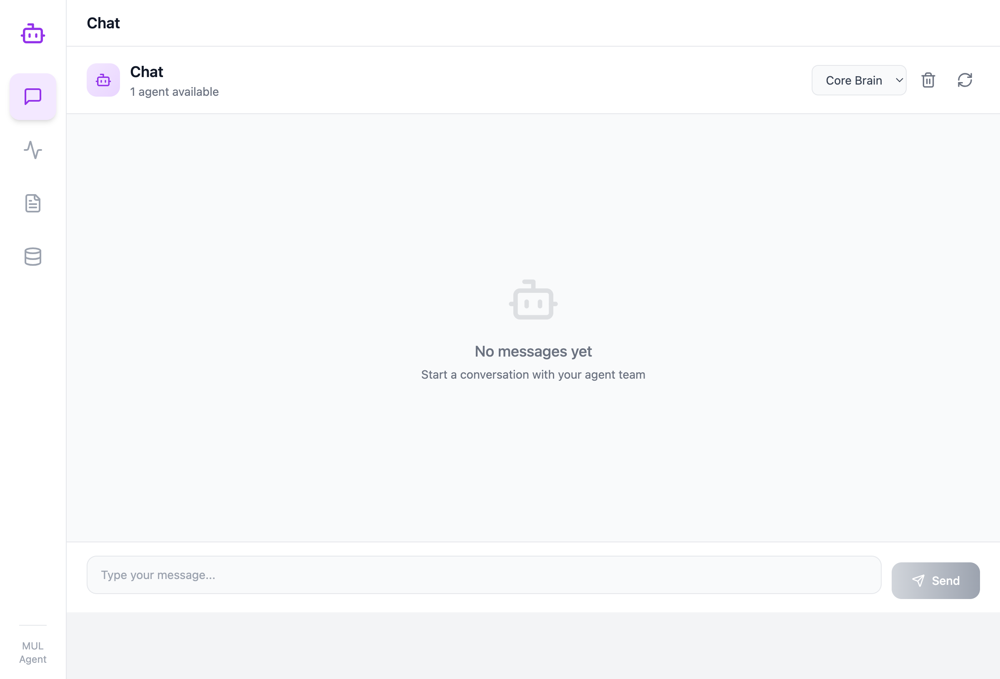

# 文档资产

此目录存放项目相关的界面截图和图片资源。

## 资源列表

### 界面截图

| 文件 | 描述 | 日期 |
|------|------|------|
| `frontend-screenshot.png` | 前端聊天界面 - 展示与 Agent 团队的对话界面 | 2026-03-06 |
| `workflow-canvas.png` | 工作流画布 - 展示 User 和 Core Brain 的节点连接图 | 2026-03-06 |
| `workflow-screenshot.png` | 日志面板 - 展示系统日志查看界面 | 2026-03-06 |
| `memory-panel.png` | 记忆面板 - 展示短/长时记忆和交接文档管理界面 | 2026-03-06 |

## 使用方式

在文档中引用图片：

```markdown

```

---

最后更新：2026-03-06
